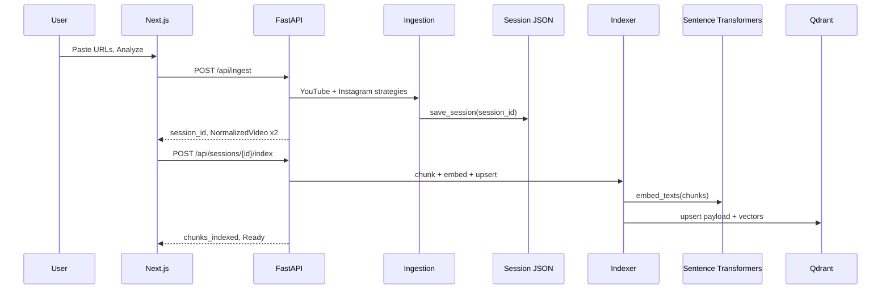
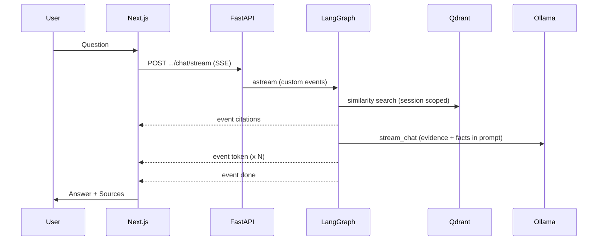

# HookLens AI — System Architecture

Technical reference for design reviews and onboarding. Describes the **current repository** as implemented—not a target production platform.


| Asset | Purpose |
|-------|---------|
| [architecture.mmd](./docs/architecture/architecture.mmd) | Editable Mermaid source |
| [architecture.svg](./docs/architecture/architecture.svg) | Vector diagram for docs and slides |
| [architecture.png](./docs/architecture/architecture.png) | Raster diagram for README embedding |

Related: [ADR.md](./ADR.md) (decision records) · [README.md](./README.md) (setup and evaluation)

---

## System overview

HookLens compares one **YouTube video (Video A)** and one **Instagram Reel (Video B)**. The user submits two public URLs; the backend extracts metadata and transcripts, indexes transcript chunks in **Qdrant**, and answers natural-language questions with **numbered citations** tied to retrieved text.

```text
User → URLs → Ingestion → Processing → Embeddings → Qdrant
     → LangGraph → Ollama → SSE → Frontend (answers + Sources)
```

**Runtime processes (local default):**

| Process | Port | Role |
|---------|------|------|
| Next.js | 3000 | UI |
| FastAPI (uvicorn) | 8000 | API + LangGraph |
| Qdrant (Docker) | 6333 | Vectors |
| Ollama | 11434 | LLM inference |

**Persistence:**

| Store | Path / service | Contents |
|-------|----------------|----------|
| Session JSON | `backend/data/sessions/*.json` | Normalized videos + index fingerprint |
| Qdrant | `hooklens_chunks` collection | Chunk embeddings + payload metadata |
| LangGraph checkpoints | `backend/data/checkpoints.db` | Per-session thread message history |

There is **no** separate microservice mesh, job queue, or auth layer in this prototype.

---

## Layer map (code-aligned)

### User layer

- **Creator** — Pastes URLs, runs Analyze, asks comparison questions in chat.
- **Reviewer** — Same UI; validates ingest, indexing, citations, and streaming behavior (see README reviewer sections).

### Frontend layer (`frontend/`)

| UI surface | Implementation |
|------------|----------------|
| Next.js | App Router, `HookLensWorkspace` on `/` |
| URL Input Bar | `UrlBar.tsx` — YouTube + Instagram fields, Analyze trigger |
| Video Comparison Workspace | `HookLensWorkspace.tsx`, `VideoCard`, `AnalysisSummary`, `TranscriptView`, `ProgressBanner` |
| Chat Panel | `ChatPanel.tsx` — SSE consumer, suggested questions, “How answers are generated” |
| Citation Panel | `CitationsList.tsx` — Sources under each assistant message |

Client API calls (`frontend/src/lib/api.ts`): `POST /api/ingest`, `POST /api/sessions/{id}/index`, `POST /api/sessions/{id}/chat/stream`.

### Backend layer (`backend/app/`)

| Component | Implementation |
|-----------|----------------|
| FastAPI | `main.py` — CORS, lifespan (graph runtime), router prefix `/api` |
| REST API | `routes.py` — ingest, index, health, retrieve (debug), non-streaming chat, history |
| SSE streaming | `EventSourceResponse` on `chat/stream` — events: `citations`, `token`, `done`, `error` |

### Ingestion layer

| Path | Tools |
|------|--------|
| YouTube | `YouTubeIngestStrategy` — `youtube-transcript-api` first; `yt-dlp` + **faster-whisper** fallback |
| Instagram | `InstagramIngestStrategy` — `yt-dlp` metadata/audio + Whisper |
| Orchestration | `IngestOrchestrator.ingest_pair` — parallel `asyncio.to_thread`, UUID `session_id`, `save_session` |

### Processing layer

| Step | Module |
|------|--------|
| Metadata extraction | `ytdlp.extract_metadata` → `normalize.build_normalized_from_metadata` |
| Engagement calculation | `services/engagement.compute_engagement_rate` — `(likes + comments) / views × 100` |
| Transcript normalization | `TranscriptSegment` list on `NormalizedVideo` |
| Semantic chunking | `retrieval/chunking.py` — char limits + overlap from settings |
| Indexing (post-ingest) | `retrieval/indexer.py` — fingerprint skip, `qdrant_store.upsert_chunks` |

Analyze in the UI is **two API steps**: ingest (extract) then index (embed + upsert).

### Retrieval layer

| Component | Module |
|-----------|--------|
| Sentence Transformers | `retrieval/embeddings.py` — `all-MiniLM-L6-v2` |
| Qdrant | `retrieval/qdrant_store.py` — cosine vectors, collection `hooklens_chunks` |
| Similarity search | `qdrant.search` at chat time |
| Metadata filtering | Payload filter on `session_id` (and optional `video_label` / `video_id` on debug retrieve) |

**Note:** Retrieval is **semantic top-k**, not time-window biased. Questions about the “first 5 seconds” depend on chunk content and embedding similarity—not a dedicated hook-time filter (see Future directions in README).

### Intelligence layer (LangGraph)

Compiled graph (`graph/build.py`):

```text
retrieve → [reasoning | memory_update if error]
reasoning → citation_assembly → generate → memory_update → END
```

| Node | File | Role |
|------|------|------|
| Retrieval | `nodes.retrieve_node` | `retriever.retrieve(session_id, query)` |
| Reasoning | `nodes.reasoning_node` | `build_comparison_facts` from session metadata |
| Citation assembly | `nodes.citation_assembly_node` | Numbered evidence block + SSE `citations` |
| Generate | `nodes.generate_node` | `ollama.stream_chat` + SSE `token` / `done` |
| Conversation memory | `nodes.memory_update_node` | Append Human/AI messages; **AsyncSqliteSaver** checkpoints |

On later turns, `generate_node` passes checkpoint **history** into Ollama. Memory loops back into LangGraph via the checkpointer (diagram: ↺).

### Model layer

| Service | Config |
|---------|--------|
| Ollama | `OLLAMA_BASE_URL` (default `http://localhost:11434`) |
| Llama 3.2 | `OLLAMA_MODEL` (default `llama3.2`) |

`GET /api/health` reports `ollama: true/false` only.

### Output layer (delivered in UI)

| Output | How it is produced |
|--------|---------------------|
| Streaming answers | SSE `token` events → `ChatPanel` |
| Video comparison analysis | `AnalysisSummary` from ingested metadata (not LLM-required) |
| Hook analysis (e.g. first 5s) | User question in chat; LLM + retrieved chunks |
| Improvement suggestions | Same chat path—no separate recommendation engine |
| Source citations | SSE `citations` → `CitationsList` |

---

## Request lifecycle

### 1. Analyze (ingest + index)



### 2. Chat (retrieve → generate → stream)



---

## Why LangGraph was chosen

The chat path is a **fixed multi-step pipeline** with early exits (missing session, not indexed), **streaming events** at citation and token boundaries, and **thread memory** across turns. LangGraph provides:

- Explicit nodes matching retrieve → reason → cite → generate → remember
- `get_stream_writer()` for SSE without bespoke generator plumbing in routes
- SQLite checkpointing (`langgraph-checkpoint-sqlite`) for `thread_id` history fed back into Ollama

**Tradeoff:** More moving parts than a single async function; justified when streaming and checkpointed follow-ups are requirements. LangGraph does **not** by itself improve retrieval quality.

---

## Why Qdrant was chosen

Each analyze run produces dozens of transcript chunks that must be searched by **semantic similarity** with strict **session isolation**. Qdrant offers:

- Filtered vector search (`session_id` in payload)
- Simple local deployment via `docker-compose.yml`
- Separation of “index once” from “many chat queries” per session

**Tradeoff:** Extra infrastructure vs in-memory search; health check does not currently validate Qdrant connectivity.

---

## Why local models were chosen

| Choice | Rationale |
|--------|-----------|
| **Ollama + Llama 3.2** | No API keys for local demos; streaming HTTP API; swappable via env |
| **Sentence Transformers on CPU** | Small model (`all-MiniLM-L6-v2`), low marginal cost per index/query |
| **faster-whisper (base)** | Offline transcription when captions/audio path requires it |

**Tradeoff:** Quality and latency depend on host hardware; no centralized quota, policy, or observability for LLM calls.

---

## Cost optimization strategy (current build)

| Lever | Mechanism |
|-------|-----------|
| Index once per session | Chunks embedded at index time; chat only embeds the **query** |
| Fingerprint skip | `indexer` skips re-embed if transcript fingerprint unchanged |
| Local inference | Ollama and embeddings run on-operator hardware for prototypes |
| Bounded context | `RETRIEVAL_TOP_K` (default 8) caps evidence size per turn |
| Sequential ingest | Two videos per analyze—not batch fleet processing (limits parallel spend, increases latency) |

**Dominant costs at scale:** Whisper CPU/GPU time on first ingest, embedding throughput, LLM tokens per chat turn, Qdrant storage growth per session.

---

## Scaling path: 1,000 → 10,000 creators/day

Illustrative staging assuming ~2 videos ingested + several chat turns per creator session. Numbers depend on video length and hardware; the **architecture moves** are the point.

| Dimension | ~1,000 creators/day (pilot) | ~10,000 creators/day (growth) |
|-----------|----------------------------|-------------------------------|
| **API** | Single FastAPI replicas; long ingest holds connection | Job queue (Celery/ARQ/Temporal) for ingest/index; async status polling or webhooks |
| **Ingest** | `asyncio.to_thread` on API host | Dedicated workers; object storage for audio; GPU Whisper pools |
| **Embeddings** | In-process Sentence Transformers | Batched embedding service or managed API; autoscale on queue depth |
| **Qdrant** | Single Docker container | Managed Qdrant / sharded collections; TTL or archival for old `session_id` |
| **LLM** | Ollama on one machine | Hosted OpenAI/Azure Foundry with token budgets, caching, model routing |
| **Sessions** | JSON on disk | Postgres + blob store; tenant isolation and encryption |
| **Memory** | SQLite checkpoints file | Durable checkpoint store (Postgres) per user/workspace |
| **Frontend** | Static Next.js | CDN deploy; rate limits at edge |
| **Observability** | Health + logs | Metrics on ingest duration, index lag, retrieval hit rate, LLM latency, cost per session |

**Bottlenecks to watch first:** Whisper ingest duration, embedding index throughput, Qdrant write rate on peak Analyze, Ollama concurrency on chat.

---

## Diagram maintenance

When changing routes, graph nodes, or storage:

1. Update [docs/architecture/architecture.mmd](./docs/architecture/architecture.mmd) to match code.
2. Regenerate raster/vector assets:

```bash
cd docs/architecture
npx -y @mermaid-js/mermaid-cli -i architecture.mmd -o architecture.png -b white -w 2400
npx -y @mermaid-js/mermaid-cli -i architecture.mmd -o architecture.svg -b white
```

3. Align [ADR.md](./ADR.md) if the decision—not just the diagram—changed.
