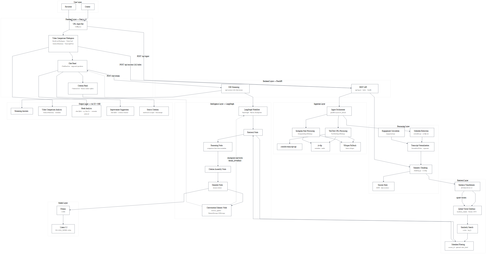

# HookLens AI

HookLens AI compares a **YouTube video (Video A)** and an **Instagram Reel (Video B)** using real metadata and transcripts, then answers creator questions with **numbered, timestamped citations**—not vibes.

---

## Overview

Creators repurpose the same idea across platforms, but performance diverges. HookLens ingests both URLs, normalizes metrics and transcripts, indexes transcript chunks in a vector store, and runs a LangGraph pipeline that retrieves evidence before generating answers. The UI shows side-by-side video cards, a comparison summary, full transcripts, and a chat panel that streams responses with source cards for every answer.

**Stack:** Next.js 15 (frontend) · FastAPI (API) · Qdrant (vectors) · Sentence Transformers (embeddings) · Ollama (generation) · LangGraph (orchestration)

---

## Problem

Cross-platform comparison is usually manual: watch both videos, skim analytics in separate apps, guess why the hook worked on one channel and not the other. That process does not scale, is hard to defend in a team review, and breaks down when you need to cite *what was actually said* in the first five seconds.

HookLens targets **evidence-backed creator intelligence**: every claim should trace to transcript text or extracted metadata, with explicit Video A vs Video B labeling.

---

## Product behavior

1. **Paste two URLs** — public YouTube watch URL + Instagram Reel URL.
2. **Analyze** — backend extracts metadata (views, likes, engagement rate, hashtags, etc.) and transcripts (YouTube captions API with Whisper fallback; Instagram via yt-dlp + Whisper when needed).
3. **Index** — transcripts are chunked, embedded, and stored in Qdrant keyed by session.
4. **Ask questions** — chat retrieves relevant chunks, assembles citations, and streams an answer that references `[1]`, `[2]`, etc.
5. **Review sources** — each assistant message lists citation cards (platform, timestamp range, excerpt, relevance).

Video labeling is fixed: **YouTube = A**, **Instagram = B**.

---

## Reviewer Quick Start

Target time: **under 2 minutes** to first cited answer (after dependencies are running).

1. **Dependencies** — `docker compose up -d` (Qdrant), `ollama serve` + `ollama pull llama3.2`, backend on `:8000`, frontend on `:3000`.
2. **Health** — `GET http://localhost:8000/api/health` should return `"status": "ok"` and `"ollama": true`.
3. **UI** — Open [http://localhost:3000](http://localhost:3000), paste a public YouTube URL (Video A) and Instagram Reel URL (Video B), click **Analyze**.
4. **Wait for Ready** — Progress shows Extract → Index → Ready; first run may take 1–2 minutes.
5. **Chat** — Use **Suggested Questions** in the chat panel or type your own; confirm streamed text and **Sources** cards under each reply.

If Analyze fails, the banner shows what failed, a likely cause, and a next step (API, Qdrant, ingest, or index). Chat errors follow the same pattern.

---

## What To Test

| Area | What to verify |
|------|----------------|
| **Ingest** | Both video cards populate with title, creator, metrics, and a non-empty transcript (or a clear ingest error). |
| **Index** | Ready state reports chunks indexed; chat is enabled only after Index completes. |
| **Retrieval + chat** | Answers stream via SSE; assistant text references Video A (YouTube) vs Video B (Instagram) explicitly. |
| **Citations** | Each answer includes numbered source cards with platform, timestamp range, and excerpt text. |
| **Grounding** | Quotes and timestamps in the answer align with cited excerpts—not invented lines. |
| **Opening hooks** | Questions about the **first 5 seconds** return evidence from early transcript segments when speech exists in that window. |
| **Explainability** | Chat panel **How answers are generated** matches behavior: retrieve → assemble evidence → cite → generate from evidence only. |

Optional: stop Qdrant or Ollama and confirm error messages name the service and recovery command (`docker compose up -d`, `ollama serve`).

---

## Example Questions

Use these to exercise retrieval, comparison, and citations (also available as one-click **Suggested Questions** in the UI):

- *Compare the first 5 seconds of both videos.*
- *Which hook is likely to retain attention better?*
- *What evidence supports your conclusion?*
- *Which transcript segments indicate stronger engagement?*
- *Compare pacing and call-to-action strategy.*
- *What happens in the first 5 seconds on each video?*
- *How does engagement differ given the metadata?*

Follow-up prompts (e.g. *What evidence supports your conclusion?*) are useful after an initial comparison answer.

---

## Expected Evidence Behavior

For each chat turn, the pipeline behaves as follows:

1. **Retrieve** — The query is embedded; up to `RETRIEVAL_TOP_K` transcript chunks (default 8) are pulled from Qdrant for the current session only.
2. **Assemble** — Chunks become numbered evidence lines (`[1]`, `[2]`, …) with Video A/B labels and `start_time`–`end_time` ranges.
3. **Stream** — SSE events: `citations` (source list), then `token` (answer text), then `done`. The model prompt includes only comparison metadata plus that evidence block.
4. **Display** — The UI renders **Sources** under the assistant message; bracket numbers in the answer should match citation indices.

**Pass criteria for reviewers:** every factual transcript claim is backed by at least one cited chunk; timestamps and excerpts are copy-consistent with the transcript view; if evidence is thin, the answer states insufficient support rather than inventing quotes.

**Not expected:** platform-native analytics beyond ingested metadata, visual/frame analysis, or answers without a completed Analyze + Index for the session.

---

## Architecture



Detailed system design documentation:

- [ARCHITECTURE.md](./ARCHITECTURE.md)
- [ADR.md](./ADR.md)

**Repo layout**

```
hooklens-ai/
├── frontend/          # Next.js App Router, Tailwind
├── backend/           # FastAPI app package
│   └── app/
│       ├── ingestion/ # URL ingest, normalize, transcripts
│       ├── retrieval/ # chunking, embeddings, Qdrant, sessions
│       ├── graph/     # LangGraph nodes + streaming engine
│       ├── api/       # HTTP routes
│       └── models/    # domain models
├── docker-compose.yml # Qdrant only
├── ARCHITECTURE.md    # system design + diagram (assets in docs/architecture/)
├── ADR.md             # architecture decision records
└── SUBMISSION.md      # reviewer-facing links (fill before submit)
```

**API surface (prefix `/api`)**

| Endpoint | Purpose |
|----------|---------|
| `GET /health` | API + Ollama reachability |
| `POST /ingest` | Extract both videos → `session_id` |
| `POST /sessions/{id}/index` | Chunk + embed + upsert to Qdrant |
| `POST /sessions/{id}/chat/stream` | SSE: `citations`, `token`, `done`, `error` |
| `POST /sessions/{id}/retrieve` | Debug retrieval (optional) |

---

## Design decisions

| Decision | Rationale |
|----------|-----------|
| **Session-scoped index** | Each analyze run gets a UUID session; demos stay isolated without multi-tenant auth. |
| **Fingerprint skip re-index** | Re-running index on unchanged transcripts avoids redundant embedding cost. |
| **Retrieve-before-generate** | LangGraph retrieves chunks and builds a numbered evidence block before Ollama sees the user question—reduces hallucinated quotes. |
| **SSE over WebSockets** | One-directional token stream fits POST + fetch; simpler to proxy and debug. |
| **Local Ollama default** | Keeps inference cost at zero for development; swappable for hosted models later. |
| **Sentence Transformers locally** | `all-MiniLM-L6-v2` is small and fast on CPU; good enough for transcript chunk retrieval at prototype scale. |
| **YouTube A / Instagram B** | Matches the product brief (long-form vs short-form Reel) and keeps prompts unambiguous. |

---

## Scaling and cost considerations

| Layer | Today | At scale |
|-------|-------|----------|
| **Ingest** | Sequential yt-dlp + optional Whisper per video | Queue workers (Celery/ARQ), object storage for audio, GPU Whisper endpoints |
| **Embeddings** | In-process Sentence Transformers | Managed embedding API or dedicated inference pods |
| **Vectors** | Single Qdrant container | Sharded collection per tenant or namespace per workspace |
| **LLM** | Local Ollama | Azure OpenAI / Foundry with token budgeting and caching |
| **Sessions** | JSON files on disk | Postgres + blob store for transcripts |
| **Chat** | SQLite LangGraph checkpoints | Durable checkpoint store (Postgres) |

**Cost drivers for a live demo:** first ingest on a new video may download audio and run Whisper—CPU time dominates; chat adds one retrieval + one LLM call per question. Re-indexing is skipped when the transcript fingerprint is unchanged.

---

## Known limitations

HookLens is a **local, session-scoped comparison prototype**. It retrieves transcript text and surfaces citations; it does **not** replace platform analytics dashboards or guarantee quote-level accuracy when transcripts or retrieval are weak. The constraints below are intentional tradeoffs for the current build, not oversights.

### Current implementation constraints

These follow directly from how the repo is wired today:

- **No auth or rate limits** — suitable for local demo, not production multi-user exposure.
- **Single-machine dependencies** — Qdrant and Ollama must be reachable; no cloud fallback configured out of the box.
- **English-first transcripts** — Whisper fallback quality varies by audio; YouTube auto-captions may be imperfect.
- **Engagement rate** — computed as `(likes + comments) / views × 100` when views are present; not platform-native analytics.

Ingest is **sequential** per video; chat sends **top-k transcript chunks** to the model (not the full recording in one context); sessions and LangGraph checkpoints persist under **`backend/data/`** on disk. Citations improve traceability but **do not eliminate** LLM mistakes—verify answers against **Sources** and the transcript panes.

### Platform limitations

These depend on YouTube, Instagram, and yt-dlp—not on HookLens business logic alone:

- **Public URLs only** — private, geo-blocked, or login-walled content may fail ingest.
- **Instagram variability** — Reel metadata and audio availability depend on yt-dlp; warnings surface in the UI when partial.

Transcript and metric quality are bounded by what each platform exposes to extractors at ingest time (caption language, missing audio, stale view counts). HookLens does **not** call official YouTube Analytics or Instagram Insights APIs and cannot cite visual-only content that never appears in the transcript index.

### Future production considerations

If this architecture were hardened for shared or public use, the same limitations above would need explicit product and ops answers:

| Gap today | Production implication |
|-----------|-------------------------|
| No auth or rate limits | Require authentication, per-tenant isolation, and abuse throttling before any external deployment. |
| Single-machine dependencies | Operate Qdrant and the LLM as managed services with monitoring; `/api/health` today only checks API + Ollama, not Qdrant depth or model quality. |
| Public URLs + yt-dlp ingest | Plan for ToS/compliance review, media retention policy, and breaker handling when extractors fail (no background retry queue in this repo). |
| Instagram variability | Expect ongoing maintenance of extraction tooling; partial ingest paths need runbooks. |
| English-first transcripts | Non-English or low-quality audio needs explicit locale/ASR strategy beyond the default Whisper/caption path. |
| Derived engagement rate | Use platform-sourced analytics for decisions; treat HookLens metrics as illustrative side-by-side context only. |

Not in scope of the current codebase: audit logging, encryption at rest for session JSON, multi-region HA, or spend guards on Whisper and LLM calls under concurrent users.

---

## Future directions

- Hosted deployment (Container Apps or similar) with secrets management and health-gated rollouts
- Auth + workspace sessions with retained comparison history
- Hook-specific retrieval (first N seconds bias) and visual frame captions
- Batch compare mode (many URL pairs) with exportable reports
- Model routing (fast vs deep analysis) and eval harness on golden Q&A pairs

---

## Environment variables

Copy examples before running:

```bash
cp backend/.env.example backend/.env
cp frontend/.env.example frontend/.env.local
```

### Frontend (`frontend/.env.local`)

| Variable | Required | Description |
|----------|----------|-------------|
| `NEXT_PUBLIC_API_URL` | Yes | Backend origin, e.g. `http://localhost:8000` (no trailing slash) |

### Backend (`backend/.env`)

| Variable | Default | Description |
|----------|---------|-------------|
| `APP_NAME` | HookLens AI | Service title |
| `DEBUG` | `false` | Verbose logging |
| `API_HOST` | `0.0.0.0` | Uvicorn bind host |
| `API_PORT` | `8000` | Uvicorn port |
| `CORS_ORIGINS` | `http://localhost:3000,...` | Comma-separated frontend origins |
| `DATA_DIR` | `./data` | Sessions, audio cache, checkpoints parent |
| `WHISPER_MODEL_SIZE` | `base` | faster-whisper model (`tiny`–`large`) |
| `QDRANT_URL` | `http://localhost:6333` | Qdrant HTTP API |
| `QDRANT_COLLECTION` | `hooklens_chunks` | Vector collection name |
| `EMBEDDING_MODEL` | `all-MiniLM-L6-v2` | Sentence Transformers model id |
| `CHUNK_MAX_CHARS` | `480` | Max characters per transcript chunk |
| `CHUNK_OVERLAP_CHARS` | `80` | Overlap between chunks |
| `RETRIEVAL_TOP_K` | `8` | Chunks retrieved per chat turn |
| `OLLAMA_BASE_URL` | `http://localhost:11434` | Ollama API base |
| `OLLAMA_MODEL` | `llama3.2` | Model tag for generation |
| `CHECKPOINT_DB_PATH` | `./data/checkpoints.db` | LangGraph SQLite checkpoint file |

---

## Local development

### Prerequisites

- Python 3.11+
- Node.js 20+
- [Docker](https://docs.docker.com/get-docker/) (for Qdrant)
- [Ollama](https://ollama.com/) with `llama3.2` pulled: `ollama pull llama3.2`
- [FFmpeg](https://ffmpeg.org/) on PATH (Instagram Reel audio + YouTube Whisper fallback). Windows: `winget install ffmpeg`

### 1. Start Qdrant

```bash
docker compose up -d
```

### 2. Backend

```bash
cd backend
python -m venv .venv
.venv\Scripts\activate          # Windows
# source .venv/bin/activate     # macOS / Linux
pip install -r requirements.txt
cp .env.example .env
uvicorn app.main:app --reload --host 0.0.0.0 --port 8000
```

Verify: [http://localhost:8000/api/health](http://localhost:8000/api/health) — `ollama` should be `true`.

### 3. Frontend

```bash
cd frontend
npm install
cp .env.example .env.local
npm run dev
```

Open [http://localhost:3000](http://localhost:3000).

---

## Tests

```bash
cd backend
pytest
```

---